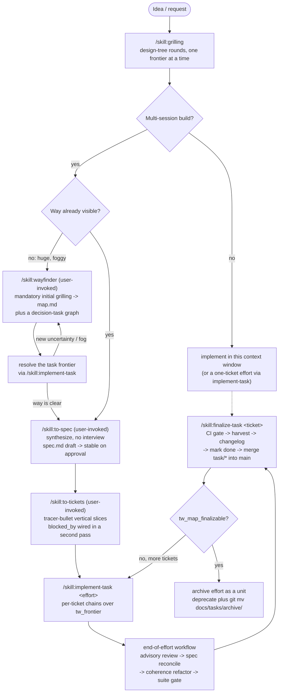
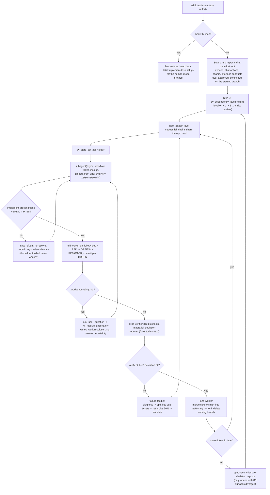
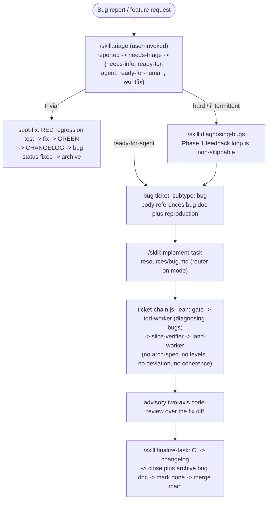
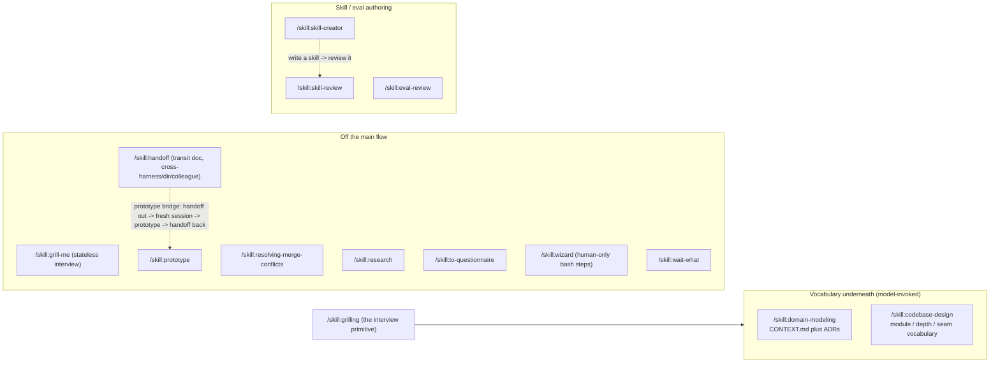

# Workflow flows

How work travels through this package, from an idea to a shipped effort. This
is a map of the current design (schema 4), assembled by reading the router,
every workflow skill, both pre-canned workflow scripts, all eleven agent
definitions, and the graph/artifact layer in `src/core/`.

## 30-second model

```
ON-RAMP                         PLAN                                   BREAKDOWN            BUILD                     SHIP
──────────────────────────────────────────────────────────────────────────────────────────────────────────────────────────────
grilling ─┐
          ├─ foggy? ─▶ wayfinder: map + decision tasks ─┐
triage ───┘             ▲ resolve tasks via implement    │
improve-arch ───────────┘ (research/prototype/grill/manual)│
                                                          ▼
                                               to-spec ─▶ to-tickets ─▶ implement-task ─▶ finalize-task ─▶ archive
diagnosing-bugs ─▶ implement-task (subtype: bug) ─────────────────────────┘        ▲
                                    └──────── new uncertainty / split → back to wayfinder / to-tickets ────────┘
```

Everything is a file under `docs/tasks/` (an OKF bundle: one directory per
**effort** holding `map.md`, `spec.md`, `tasks/` decision tasks, and
`tickets/` implementation tickets) plus `docs/bugs/`. There is no external
issue tracker. The `tw_*` Pi tools are read-only queries over that tree; the
only writers are the agent's own edits plus `tw_set`, `tw_state_set`, and
`tw_resolve_uncertainty`.

## The substrate the flow runs on

| Concept | Where | Meaning |
|---|---|---|
| effort | `docs/tasks/<effort>/` | The unit that archives. The grouping key is the directory. |
| map | `map.md` | Wayfinder's low-resolution plan: Destination, Constraints, Decisions so far, Fog, Out of scope. |
| decision task | `tasks/<slug>/task.md` | `subtype: research \| prototype \| grilling \| manual`. Produces decisions. |
| spec | `spec.md` | `to-spec` output, `draft` then `stable` on approval. |
| ticket | `tickets/<slug>/ticket.md` | `subtype: feature \| bug`, `blocked_by`, `size` (s/m/l/xl), optional `mode: human`. |
| arch-spec | `arch-spec.md` | The feature pipeline's per-effort interface and seam contract, user-approved, committed before the first chain. |
| bug doc | `docs/bugs/<slug>.md` | `reported` through triage roles to `fixed`; archived under `docs/bugs/archive/`. |
| state | `docs/tasks/state.yaml` | `schema_version: 4`, a `map` pointer, a `task` pointer. |

Artifact frontmatter has two orthogonal axes: OKF `status` (`draft | stable |
deprecated`) and `workflow_state` (`todo | ready | in-progress | blocked |
done`). They are paired and validated: `draft` pairs only with `todo`, and
`deprecated` pairs only with `done`.

Graph semantics from `src/core/graph.ts`: edges are **kind-scoped** (tasks to
tasks, tickets to tickets) and **effort-scoped**; tasks and tickets are
levelled independently; `done` gates on `workflow_state: done` only
(deprecated counts as done and drops out of the graph); an effort is
finalizable when nothing is unfinished and, if a spec exists, at least one
ticket exists.

## Main flow: idea to ship (feature path)



Two planning entry stories coexist. The router `task-workflow-overview` puts
`grilling` at the top and treats **wayfinder as an on-ramp** for fog;
wayfinder's own description and the Actions table present it as **the
planning entry** ("plan an idea"). Both end at `to-spec`.

## Phase 3 detail: the per-ticket chain

Feature tickets use `scripts/ticket-chain.js`. The orchestration rules are:
async dispatch only, the parent never implements, and children receive
pointers rather than authored prompts.



Notable invariants:

- **Landing is not done.** The chain never sets `workflow_state: done`;
  `finalize-task` is the single owner of that marking.
- **Branch ladder.** `main -> task/<ticket> (landing) -> ticket/<ticket>
  (working)`. The land-worker merges working into landing; finalize merges
  landing into main.
- **Gating is enforced, not trusted.** Each host gate is a real command
  (`test -f`, `git rev-parse`), and verdict children must open their output
  with an exact marker (`VERDICT: PASS`, `RECONCILED`, `REFACTORED`, `SUITE:
  GREEN`), checked fail-closed.
- **Uncertainty is a designed escape hatch,** recorded with
  `submit_feedback({kind: "expected"})`, resolved through the scoped tool,
  then the chain is relaunched with a pointer to the resolution.
- **End-of-effort** is a second shipped workflow: advisory `code-reviewer`
  (never gates), gated `spec-reconciler`, gated `coherence-refactorer` (only
  when the model composed an inconsistencies list), and an always-run gated
  `test-runner` reading the repo's `docs/testing.md`.

Planning subtypes (`research`, `prototype`, `grilling`, `manual`) are
deliberately non-coding: they run the matching `resources/*.md`, may delegate
to the standalone `research` or `prototype` skill, and, unlike tickets, the
resource itself marks the task `done`.

## Bug on-ramp



## Everything else: on-ramps, side skills, meta layer



`task-workflow-doctor` diagnoses a broken workflow and routes; it never fixes.
`setup-workflow` bootstraps or migrates a repo by reading `state.yaml`'s
`schema_version` (fresh, behind, or no-op). Repo gating auto-disables the
whole package in work repos based on `git origin` (see `docs/repo-gating.md`).

## Full skill inventory

| Skill | Reach | Where it plugs in |
|---|---|---|
| `task-workflow-overview` | model | Router: intent to skill or flow; read-only `tw_*` query table |
| `setup-workflow` | user | Onboard or migrate to schema 4 |
| `wayfinder` | user | Planning entry for foggy work: map plus decision tasks, mandatory grilling |
| `to-spec` | user | Collapse conversation or map decisions into `spec.md` |
| `to-tickets` | user | Spec to tracer-bullet tickets with `blocked_by` |
| `implement-task` | model | Frontier execution: per-ticket chains, planning resources, failure toolbelt |
| `finalize-task` | model | CI gate, harvest, changelog, mark done, merge to main, archive effort |
| `triage` | user | Bug and request state machine, agent briefs, spot-fix path |
| `task-workflow-doctor` | model | Diagnose and route a broken workflow |
| `improve-codebase-architecture` | user | Survey, pick a candidate, hand to wayfinder |
| `grilling` | model | Interview primitive underneath many skills |
| `domain-modeling` | model | `CONTEXT.md` and ADR vocabulary layer |
| `codebase-design` | model | Deep-module vocabulary, architecture scout |
| `tdd` | model | Reference consulted by `tdd-worker` |
| `diagnosing-bugs` | model | Six-phase discipline for bug chains and standalone use |
| `code-review` | model | Two-axis advisory review (end-of-effort, bug diff) |
| `prototype` | model | Throwaway artifact answering one design question |
| `research` | model | Background cited-markdown investigation |
| `resolving-merge-conflicts` | model | In-progress merge or rebase |
| `wizard` | model | Generate a human-run bash wizard |
| `grill-me` | user | Stateless interview, no repo assumed |
| `handoff` | user | Transit doc across harness, directory, colleague, or fork |
| `to-questionnaire` | model | Turn an unanswerable decision into a questionnaire |
| `teach` | user | Multi-session learning |
| `wait-what` | user | Corrective for a message that did not land |
| `writing-for-agents` | model | Reference for agent-consumed prose |
| `skill-creator` | model | Author or fix an Agent Skill |
| `skill-review` | model | Multi-criterion review of an Agent Skill |
| `eval-review` | model | Review an Inspect eval suite or triage a failed run |

## Context-management rules baked into the flow

- One **unbroken context window** for grilling, to-spec, and to-tickets, so
  the spec and tickets inherit the reasoning verbatim.
- `implement-task` starts **fresh per ticket**; the ticket document is the
  contract, and the arch-spec plus repo standards files are the pointers.
- `deviation-reporter` **forks** the tdd-worker's context; most other workers
  are fresh.
- `PHASE-BOUNDARIES.md` gives the ordered tree at any phase boundary:
  Continue, `/clear`, `/skill:handoff`, subagent, `/compact`. Continue when
  the next phase needs this phase as a primary source (the
  grilling-to-implementation case). `/clear` is the cheapest move but is
  one-way when the context is relevant.

## Audit notes

The flow is coherent and unusually disciplined about single-writer ownership,
but there is real drift:

1. **The top-level `README.md` is v2-era and violates `AGENTS.md`.** It still
   says "6 skills instead of 10", "3 agents instead of 7", "parallel fan-out
   with git worktrees", and "verifier retry path". The package is v4.0.0 with
   29 shipped skills, 11 agents, sequential same-level chains, and a
   diagnose/split/retry/escalate toolbelt. `AGENTS.md` also requires every
   promoted skill to be referenced in the top-level README, and it references
   none.
2. **`skills/engineering/README.md` is stale and miscategorized.** It lists
   `report-bug` (now in `deprecated/`), omits `to-spec`, `to-tickets`,
   `triage`, `prototype`, `research`, `resolving-merge-conflicts`, and
   `wizard`, and files `setup-workflow`, `to-spec`, `to-tickets`, and `triage`
   under Model-invoked when all four set `disable-model-invocation: true`. Its
   in-flight note about the `adopt-mp-skills-way` map has already landed.
3. **`skills/productivity/README.md` says the opposite of reality.** It
   claims `grill-me`, `handoff`, `to-questionnaire`, `teach`, and
   `writing-for-agents` are "added by the map"; they are present and shipped.
   `grill-me`, `handoff`, `teach`, and `wait-what` are user-invoked;
   `to-questionnaire` and `writing-for-agents` are model-invoked.
4. **Stale script headers contradict the async hard rule.** Both
   `ticket-chain.js` and `end-of-effort.js` still show `wait({ id }) // then
   read the result`, which commit `d6a74cd` removed from the prose docs.
5. **Done-versus-landed ordering is under-specified.** `implement-task` says
   "after the current frontier has been completed, call `/skill:wayfinder` to
   reassess" before declaring the effort complete, while
   `feature/autonomous.md` Step 4 says to run `/skill:finalize-task` per
   ticket. Because landing does not set `workflow_state: done`, a wayfinder
   reassessment between landing and finalize still sees those tickets on the
   frontier. The two orderings should be pinned to one.
6. **Mixed-subtype efforts have no single driver.** The dependency-level loop
   lives in `feature/autonomous.md`; `bug/autonomous.md` is single-ticket with
   no levels. Since `to-tickets` can emit both `feature` and `bug` tickets in
   one effort, no resource walks both through levels.
7. **The single-session branch routes to a skill that needs an artifact.**
   `task-workflow-overview` sends "not multi-session" to
   `/skill:implement-task` "right here", but `implement-task` routes by
   reading an artifact's `subtype` and `mode`; with no ticket there is nothing
   to resolve.
8. **Triage's output bridge is implicit.** Triage writes agent briefs onto
   bug docs and flat tasks, while `implement-task`'s resolver expects
   effort-shaped `tasks/` and `tickets/` (the legacy flat shape is supported).
   How a `ready-for-agent` brief becomes a graph node is never stated.
